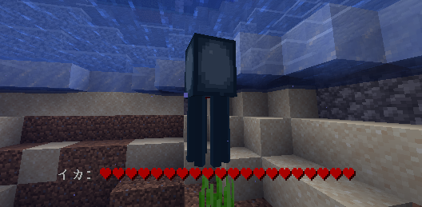

<Danger>
このページはアーカイブとして公開されています。記載内容は最新ではない可能性があります。
</Danger>

アクションバーを利用してエンティティの状態を表示します。

## コマンド

### /actionhealth reload

コンフィグをリロードします。

### /actionhealth toggle

表示/非表示を切り替えます。

## Permissions

- ActionHealth.Reload
   
  Reloads config.

- ActionHealth.Health
   
  This will send the player the health message only if 'Use Permission' is enabled in the config.
