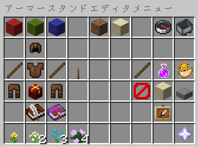

<Danger>
このページはアーカイブとして公開されています。記載内容は最新ではない可能性があります。
</Danger>

防具立て(アーマースタンド)のデータをコマンドレスで編集できます。

## 使い方

1. 編集ツール(デフォルトでは火打石)をメインハンドに持ちます。
2. 何もない所を左/右クリックしてメニューを開きます。
3. ラベルの付いたメニューオプションを選択します。
4. 編集ツール(デフォルトでは火打石)を持った状態でアーマースタンドを左/右クリックして、これらのオプションを適用します。

## ヒント

- スニークキー(デフォルトは `Shift`) + スクロールホイールの上下に軸をすばやく変更します
- ボディパーツを左クリックで回転させると一方向に回転し、アーマースタンドを右クリックすると反対方向に回転することに注意してください。
- 粗調整は体の部分をすばやく回転させ、微調整は位置が近づいたら微調整することができます。
- アーマースタンドの設定をコピーすると、ツールは自動的に貼り付けモードに切り替わります
- 他のアーマースタンドが邪魔になっていませんか?アイテム切り替えキー(デフォルトは `F`)を押して、特定のアーマースタンドをターゲットにします。

## Permissions

- asedit.basic
   
  Allow use armorstand edit functions. If set to false it will override all other functions.

- asedit.armorstand.invisible
   
  Toggles ArmorStand visibility.

- asedit.itemframe.invisible
   
  Allows setting of ItemFrame Visibility

- asedit.rename
   
  Rename armorstands - Now Supports Color

- asedit.equipment
   
  Access armorstand equipment GUI

- asedit.disableslots
   
  Allows locking and unlocking the contents of an ArmorStand. When locked, armor and equipement can not be added or removed without unlocking it first.

- asedit.update
   
  Allows the checking for updates.
