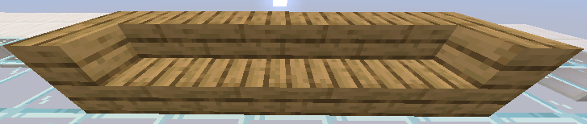
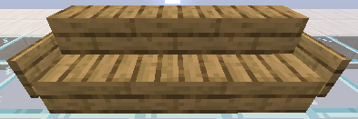

<Danger>
このページはアーカイブとして公開されています。記載内容は最新ではない可能性があります。
</Danger>

プレイヤーは椅子(階段)に座ることができます。

## 使い方

以下の条件を満たすことで、座ることができます。

### コーナー階段

### 看板

## Permissions

- chairs.reload
   
  `/chairs reload `- Reload the Chairs configuration file.

- chairs.sit
   
  Sit down on chairs.

- chairs.sit.health
   
  If the health sitting effects are enabled then players with this permission node are healed while siting.
