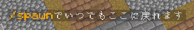

<Danger>
このページはアーカイブとして公開されています。記載内容は最新ではない可能性があります。
</Danger>

モダンなホログラムを作成します。

## コマンド

### hd

プラグインのメインコマンド、`/hologram` の短いエイリアス。それに関する情報、バージョン、および開発者を表示します。

### /hd help

プラグインのメインコマンドを表示し、コマンドにカーソルを合わせると、それぞれのヘルプが表示されます。

### /hd create &lt;hologramName&gt; [text]

現在地に指定された名前の新しいホログラムを作成します。この名前は、他のコマンドで使用されます。オプション: デフォルト行を置き換えるテキストを追加します。

### /hd delete &lt;hologram&gt;

ホログラムを削除します。

### /hd list [page]

既存のすべてのホログラムとその場所を一覧表示します。

### /hd near &lt;radius&gt;

指定した半径内のすべての近接ホログラムを一覧表示します。

### /hd teleport &lt;hologram&gt;

ホログラムにテレポートします。

### /hd align &lt;x|y|z|xz&gt; &lt;hologramToAlign&gt; &lt;referenceHologram&gt;

指定された軸で、最初のホログラムを 2 番目のホログラムに整列させます。例えば、`y` は 2 つのホログラムを垂直方向に揃え、同じ高さに移動させ、`xz` は水平方向に揃え、同じ x/z 位置に移動させます。

### /hd movehere &lt;hologram&gt;

ホログラムを足の位置に移動します。

### /hd edit &lt;hologram&gt;

既存のホログラムを変更するために使用可能なすべてのコマンドを一覧表示します。

### /hd addline &lt;hologram&gt; &lt;text&gt;

ホログラムにテキスト行を追加します。

### /hd removeline &lt;hologram&gt; &lt;number&gt;

[number]行を削除します。

### /hd setline &lt;hologram&gt; &lt;number&gt; &lt;newText&gt;

[number] 行を削除します。

### /hd insertline &lt;hologram&gt; &lt;number&gt; &lt;text&gt;

[number] 行の後に行を挿入します。番号が 0 の場合、行は先頭に挿入されます。

### /hd info &lt;hologram&gt;

ホログラムの内容を行番号付きで表示します。

### /hd copy &lt;fromHologram&gt; &lt;toHologram&gt;

最初のホログラムの内容を 2 番目のホログラムにコピーします。コマンドを実行した後、それらは同一になります。

### /hd readtext &lt;hologram&gt; &lt;fileWithExtension&gt;

テキスト ファイルから行を読み取ります。ファイル (`logo.txt` など) を作成し、プラグインのフォルダーに配置します。新しいホログラム (`test` など) を作成し、`/hd readtext test logo.txt` を実行して、テキスト ファイルをホログラムに貼り付けます。

### /hd readimage &lt;hologram&gt; &lt;imageWithExtension&gt; &lt;width&gt;

プラグインのフォルダまたは URL（パスが `http://` で始まる場合）から、指定された幅の画像を読み込みます（自動的にリサイズされます、最大幅は 150 ピクセルです）。使用されるシンボルは、設定から取得されます。透明な背景もサポートしており、スペースとして使用する文字列を設定から選択できます。

フラグ `-a` を使用すると、ホログラムの内容を置き換える代わりに、画像を最後に追加します。

### /hd reload

構成ファイルと保存されたホログラムを再読み込みします。

## Permissions

- holographicdisplays.command.&lt;subCommand&gt;
   
  Each subcommand has an individual permission depending on its name. For example, the command `/hd list` requires the permission holographicdisplays.list. The main command `/hd` is accessible by everyone.

- holographicdisplays.update
   
  Receive update notifications on join if enabled in the configuration.
